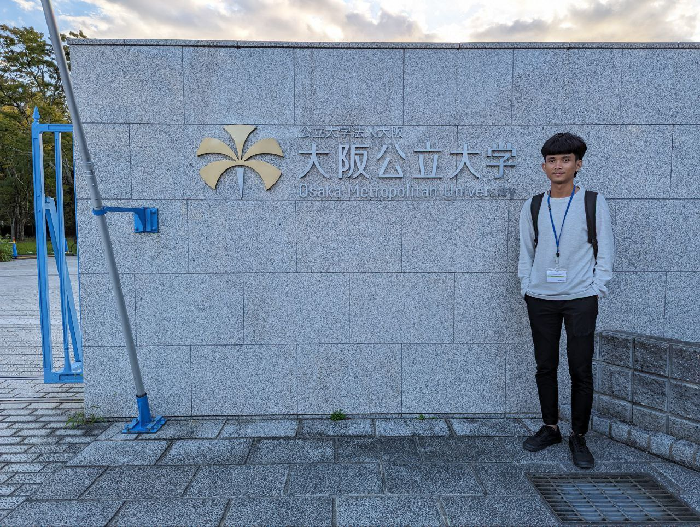

<figure style="float:right; margin:0 0 1em 1em; width:40%;">
    
    <figcaption>Vonmonyroth Keo, Engineering's Degree in Data Sicence
    </figcaption>
</figure>

I am interested in optimization, computer vision, machine learning, deep learning and IoT (Internet of Things).

Currently, I am working on my self-portfolio and conducting research in Artificial Intelligence (AI) and Machine Learning (ML).
I graduated from in __Institute of Technology of Cambodia__.
The manuscript of my Engineering research can be found [here](https://monyroth07.github.io/assets/Keo_vonmonyroth_thesis.pdf)

# Education:

__02/2020 - 02/2025__ : _Engineer’s Degree in Data Science_, **Institute of Technology of Cambodia**, Cambodia

# Professional Experiences:

__08/2025 - present__ : _Working on my self-portfolio_

__02/2025 - 07/2025__ : _AI Engineer_, the [AI Farm Robotics Company](https://aifarm.dev).

__07/2024 - 12/2024__ : Data Siencetist Intern in __Ministry of Education Youth and Sport__.
Analyzed national educational datasets to identify trends in Student, Teacher, School.

__01/2024 - 07/2024__ : Research Assistant in Research and Data Analytics Lab of __Institute of Technology of Cambodia__.
Conducted research on wireless sensing for human detection and movement tracking using Wi-Fi Channel State Information(CSI).

# Projects:

__Image and Text to robot command__

leading and developping a small to VLM-based system that interprets image-text input to
generate actionable commands for robot navigation. Programming in Python (using [Flask](https://flask.palletsprojects.com/en/3.0.x/)), the video of the project can be watched [here](https://monyroth07.github.io/assets/vlm_for_mobile_robot.mp4)

__Inventory Custodian__

leading and developping a small system to control the flow of items from one location to another in a company. Programming in Python (using [Flask](https://flask.palletsprojects.com/en/3.0.x/))

__Robot Navigation using LLM__

leading and developping a LLM to control robot via human unstructured command. Programming in Python (using [HuggingFace](https://huggingface.co))

__AlphaZero for Ouk Chaktrang__

leading and developping AlphaZero to play Ouk Chaktrang, Khmer chess known as a variant of Makruk chess. Programming in Pyhon.

__Differential Drive Robot Navigation__

implementing Astar and Dstarlite algorithms for navigation and obstacle avoidances. Programming in Python and ROS2.

<!-- 09/2018 - 03/2019 : -->
__Image Detection and Recognition applied on insects__

school project as the application in industrial problem. Detecting and recognizing the stages of insects using their images. Implementing AlexNet and Object Detection algorithm. Programming in Python

<!-- 04/2017 - 06/2017 :  -->
__Drone that follows colored ball__

Programming a drone that detects and follows a colored ball. Programming in Python and ROS

<!-- 09/2016 - 05/2017 : -->
__Robotic competition__

working in group of 12 students, building a robot achieving different goals during the competition. Programming in C.